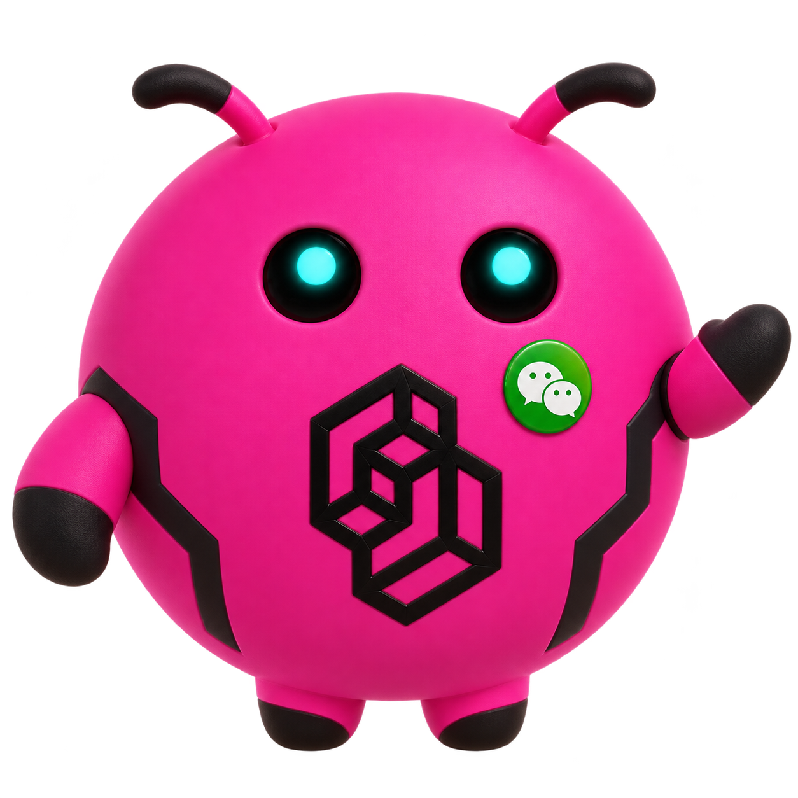
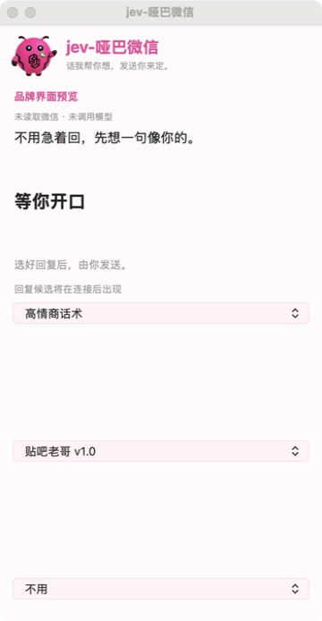

# jev-哑巴微信

**微信里的话不知道怎么接？让 AI 帮你看懂，再帮你想好怎么回。**

jev-哑巴微信是一款 macOS 微信聊天助手，悬浮在微信窗口旁：读取当前聊天，分析对方的意图和沟通风险，用 GPT 生成不同语气的回复。你挑一句，点「填入」，检查后在微信里发送。

**话我帮你想，发送你来定。**

<p align="center"></p>

## 收到消息之后，它帮你做什么？

**看聊天 → 判意图 → 提醒风险 → 给出回复 → 一键填入。**

你留在微信里聊天，助手在旁边提供建议，不必反复把对话复制到另一个 AI 聊天窗口。

| 你遇到的情况 | 助手提供的帮助 |
|---|---|
| 同事问「这个方案今天能给我吗？」 | 结合近期对话判断是在问进度还是催进度，提示如何交代现状、回应时间安排 |
| 对方情绪有点冲，不知道怎么接 | 展示沟通风险和行动建议，再给出不同措辞供你比较 |
| 想拒绝、想简短一点，又怕语气不合适 | 切换「拒绝加班」「稳如老狗」「高情商话术」等风格重新生成 |
| 群聊聊得很快，突然不知道接什么 | 结合识别到的发送者和最近几条消息，准备能接上话题的候选 |

这些是使用场景示例。意图和风险是模型的判断，回复中的事实、承诺和时间仍需你确认。

## 核心功能

- **贴着微信用**：原生悬浮窗随微信窗口移动，支持多显示器定位；可以收起、隐藏或暂停读屏。
- **读取当前聊天**：捕获微信窗口，用 macOS Vision 在本机识别聊天文字、左右消息和群聊发送者，无需导出聊天记录。
- **结合上下文判断**：新消息分析使用当前识别到的最近最多 4 条上下文，区分派活、催进度、问进度、批评、要解释、闲聊、约会议、夸奖这 8 类意图。
- **风险与行动建议**：显示 0–9 档沟通风险，并给出对应的回应方向，帮助你先想清楚再开口。
- **多种话术一起比较**：内置 9 种风格，同时最多选 3 种；每种请求生成 2 条回复，一条稳妥、一条更有个性，最多展示 6 条候选。
- **候选合适度排序**：GPT 负责写回复，判断模型负责评估候选，面板按话术分组展示排序结果。
- **复制或直接填入**：选中回复可复制，也可通过 macOS 辅助功能写入微信输入框；已有文字时追加，写入后读回确认。**发送由你操作。**
- **更及时地响应新消息**：画面未变时跳过重复 OCR；消息到达后提前判断，停稳后展示并生成回复，分析期间继续读屏。启动时在后台预热 OCR 和本地判断模型。

## 一句话，也可以有不同的说法

内置话术：**高情商话术、贴吧老哥 v1.0、拒绝加班、卑微乙方、稳如老狗、已读乱回、职场黑话、阴阳怪气、理科直男**。

每个话术下拉框就是一组候选。默认启用「高情商话术」和「贴吧老哥 v1.0」，第三组可自行选择；选「不用」即可关闭该组。更换话术后，会针对当前消息重新生成。

也可以写自己的风格。在配置文件里加入下面一行，重启生效：

```sh
export JEV_TONES="自然接话=像平时微信聊天，简短、自然，少用表情，不刻意暧昧|温柔一点=先回应对方感受，再自然接话，不说教，不乱承诺"
```

用 `|` 分隔多种风格，格式为「名字=说明」。同名设置会覆盖内置话术。

## Jev 和 GPT 各负责什么？

**Jev 帮你判断，GPT 帮你表达。**

| 模块 | 作用 | 配置方式 |
|---|---|---|
| 判断层 | 分析意图、评估风险、给候选排序 | 配置 TypeSafe Jev；不填 Key 则使用本地 decider-2b |
| 生成层 | 按所选话术写回复 | 配置 GPT API，支持 Responses 和 Chat Completions |

Jev 输出判断和评分，不负责写聊天文本。未配置 GPT 时，仍可使用判断层，但不会生成候选回复。使用本地判断模型时，首次可能需要下载约 7 GB 模型文件；启动时会后台预热，准备完成前仍需等待。TypeSafe 调用失败时，程序会回退到本地判断模型。

## 开始使用

当前提供源码，适用于 **macOS 13 及以上**。本仓库暂未发布可直接下载的安装包。

### 1. 下载源码

```sh
git clone https://github.com/wuxie888/jev-yaba-wechat.git
cd jev-yaba-wechat
```

### 2. 配置模型

创建本机配置文件：

```sh
mkdir -p ~/.config/jev-yaba-wechat
touch ~/.config/jev-yaba-wechat/env
chmod 600 ~/.config/jev-yaba-wechat/env
```

用文本编辑器打开 `~/.config/jev-yaba-wechat/env`，填入：

```sh
# GPT：负责写回复，填你账号可用的模型 ID
export OPENAI_API_KEY="你的GPT_API_Key"
export OPENAI_BASE_URL="https://api.openai.com/v1"
export OPENAI_MODEL="your-gpt-model-id"
export OPENAI_API_FORMAT="responses"

# Jev：负责判断；留空则使用本地模型
export TYPESAFE_API_KEY=""
export TYPESAFE_BASE_URL="https://api.typesafe.ai"
export TYPESAFE_MODEL="jev-latest"
```

使用兼容服务时，填写服务商提供的基础地址、Key 和模型名。Responses 会在基础地址后接 `/responses`，上述配置对应 `/v1/responses`；已填写完整 `/responses` 地址时不会重复追加。服务商只支持 Chat Completions 时，将 `OPENAI_API_FORMAT` 改为 `openai`。修改后重启应用。

### 3. 启动并授权

打开微信，进入要使用的聊天，再运行：

```sh
./start.command
```

首次启动会准备 Python 和运行依赖，需要联网。到「系统设置 → 隐私与安全性」开启：

| 权限 | 用途 |
|---|---|
| 屏幕录制 | 读取微信窗口，在本机识别聊天文字；授权后退出并重新启动助手 |
| 辅助功能 | 将选中的回复填入微信输入框；只使用复制时可暂不开启 |

从源码启动时，授权对象可能是运行它的终端或 Python；使用 `.app` 时，为对应应用授权。

### 4. 在微信旁挑选回复

保持聊天窗口打开，助手读取到对方消息后自动分析。先看意图与建议，再挑选回复，点击「复制」或「填入」。确认收件人和文字后，在微信里发送。

菜单栏「哑巴」提供显示/收起、暂停读屏、立即重新分析和退出入口。

<details>
<summary>查看当前界面预览</summary>



这是界面预览，图中未读取微信或调用模型。

</details>

## 聊天内容如何处理？

窗口图像在本机交给 OCR 识别。开启读屏后，检测到消息会自动触发分析和生成：使用 GPT 时，消息文字、近期上下文和话术说明会发往你配置的生成服务；使用 TypeSafe Jev 时，判断所需文字及候选也会发往对应服务。本地判断模式不需要将判断请求发往 TypeSafe。

助手通过窗口捕获和辅助功能工作，不注入微信进程、不 hook、不解密聊天数据库，也不自动发送消息。API Key 保存在你本机的配置文件中，不随源码发布。

## 当前状态与限制

当前为 **0.2.0 开发预览版**，已合入截至 2026-09-22 本次同步时的读屏优化、启动预热和提前判断更新。已完成品牌界面、构建检查及 Responses 离线接口测试；本版本在真实微信中的完整读屏、GPT 调用和填入流程仍待验收。详见 [验证记录](docs/BRAND_VERIFICATION.md)。

- OCR 受窗口布局和微信版本影响，可能误认说话人、引用内容或文章卡片；图片、语音和表情包的含义暂不支持可靠识别。
- 风险分数和候选百分比是模型评估，不代表已验证的准确率或发送效果。
- 生成速度取决于模型、服务商和网络；本地模型首次下载与加载会增加等待时间。

## 开发与反馈

构建本机应用：

```sh
./packaging/build_app.sh
# 生成：jev-哑巴微信.app
```

打包 ZIP：

```sh
./packaging/release.sh
```

应用采用启动器包，首次正式启动安装运行依赖。当前未做 Apple 公证。只查看界面可运行 `uv run python src/hud.py --brand-preview`，该模式不读取聊天或调用模型。

遇到问题或有想要的话术，欢迎 [提交 Issue](https://github.com/wuxie888/jev-yaba-wechat/issues)。排查日志位于 `~/Library/Logs/jev-yaba-wechat.log`。

## 许可与致谢

采用 [MIT 许可](LICENSE)，感谢 [jev-jarvis](https://github.com/jev-jarvis/jev-jarvis) 的开源贡献；版权与来源说明见 [NOTICE](NOTICE.md)。
